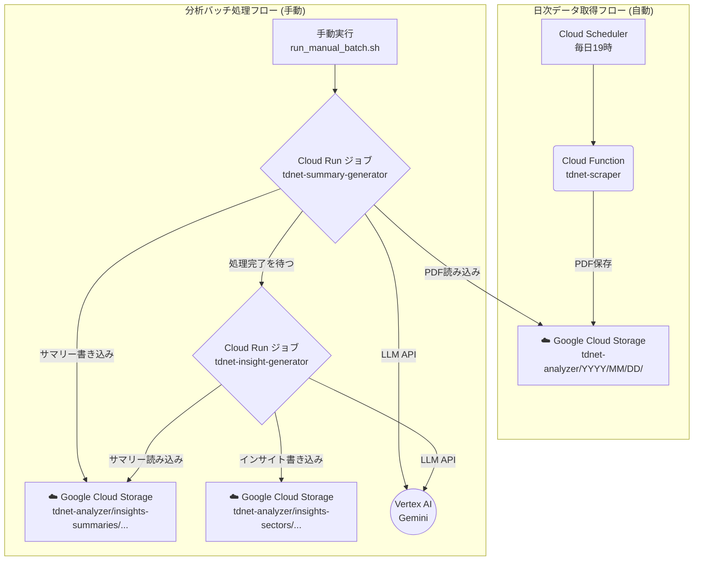

# TDnet Analyzer for Google Cloud

本システムは、日本取引所グループが提供する適時開示情報閲覧サービス（TDnet）から企業の開示資料（PDF）を自動的に収集し、Google CloudのVertex AI Geminiモデルを利用して、指定された分析レポートを生成する一連のツール群です。

日次でのデータ収集を自動化するとともに、任意の期間を指定して分析バッチを実行する機能を備えています。生成されるレポートは、個別企業のファンダメンタルズ分析や、セクター単位での市場動向把握を支援することを目的としています。

コアコンポーネントはサーバーレスアーキテクチャ（Cloud Functions, Cloud Run）で構築されており、処理実行時のみ課金されるため、コスト効率に優れた運用が可能です。

## 主な機能

*   **日次データ自動収集:** Cloud SchedulerとCloud Functionにより、毎日定時にTDnetから最新の開示資料PDFをGCS（Google Cloud Storage）に保存します。
*   **オンデマンド分析バタック処理:** Cloud Runジョブを利用し、指定した期間の収集済みPDFを対象として、以下の2種類の分析レポートを生成します。
    1.  **個別企業サマリー:** 企業ごとに、決算短信などの内容に基づき、業績、事業戦略、リスク要因などを要約したレポート。
    2.  **セクター別インサイト:** 「業種」と「企業規模（Core30, Large70など）」で分類されたグループごとに、共通のトレンド、リスク、競合状況などを分析したレポート。

## アーキテクチャ

本システムは、以下の2つの独立した処理フローから構成されます。

1.  **日次データ取得フロー（自動実行）**: 毎日定時にCloud SchedulerがCloud Functionを起動し、その日のTDnet開示PDFをGCSに収集・保存します。
2.  **分析バッチ処理フロー（手動実行）**: ユーザーが手動でスクリプトを実行すると、Cloud Runジョブが起動し、指定された期間のPDFを対象に、サマリー生成とインサイト抽出を順番に実行します。



### コンポーネント

-   **Cloud Functions**: サーバーレスの実行環境。日次のTDnet PDF収集という、軽量で定期的なタスクを担当します。
-   **Cloud Run ジョブ**: コンテナ化されたバッチ処理を実行するサーバーレス環境。サマリー生成やインサイト抽出といった、最大60分の実行時間が必要となる、計算負荷の高いタスクを担当します。
-   **Google Cloud Storage (GCS)**: 取得したPDFドキュメント、個別サマリー、最終的なセクターインサイトレポートを保存します。
-   **Vertex AI (Gemini)**: PDFの内容を理解し、高品質なサマリーとインサイトを生成するための大規模言語モデル。
-   **Cloud Scheduler**: `tdnet-scraper` Cloud Functionを毎日定時に起動するためのトリガー。

### コストに関する注記

本システムは、日々の運用コストを最小限に抑えるように設計されています。低コストを実現している主な理由は以下の通りです。

*   **サーバーレスアーキテクチャ:**
    コア機能はGoogle Cloud FunctionsおよびCloud Run上で実行されます。これはサーバーレスのコンピューティングサービスであり、コードが実行されている時間だけ課金されます。サーバーを常時稼働させる必要がないため、待機コストは一切かかりません。

*   **費用対効果の高いLLM:**
    分析には、GoogleのVertex AIが提供する大規模言語モデルを利用しています。

*   **無料利用枠の活用:**
    Google Cloud Platformの各サービス（Cloud Functions, Cloud Storage, Vertex AI, Cloud Scheduler, Cloud Run）には、一定量までの利用が無料となる「無料利用枠」が設定されています。本システムは1日1回、短時間実行されるバッチ処理が中心のため、多くのケースでこの無料枠の範囲内に収まり、**月額費用がほぼゼロになる可能性**があります。

> ※注意: 将来的に処理対象の企業数を大幅に増やしたり、より高機能なLLMモデルに変更した場合は、別途コストが発生します。詳細は[Google Cloudの料金計算ツール](https://cloud.google.com/products/calculator)をご参照ください。

## プロジェクト構成

```
tdnet-analyzer/
├── 📁 config/                    # 設定ファイル
│   └── config.yaml              # メイン設定（LLM、GCS、スクレイピング設定）
├── 📁 inputs/                   # 入力データ
│   └── companies.csv            # 企業一覧（33業種区分、規模区分含む）
├── 📁 prompt_templates/         # LLMプロンプト定義
│   ├── summary_system_prompt.md
│   ├── summary_system_prompt_small.md
│   ├── summary_user_prompt.md
│   ├── sector_system_prompt.md
│   └── sector_user_prompt.md
├── 📁 keys/                     # 認証鍵（ローカル開発用）
│   └── *.json                   # Google Cloud サービスアカウント鍵
├── 📁 logs/                     # ログファイル
├── 📁 downloads/                # GCSからのダウンロード用ディレクトリ
│
├── 🐍 **メインスクリプト**
│   ├── main.py                  # [CF] 日次スクレイピング用エントリーポイント
│   ├── tdnet_cloud.py           # TDnetスクレイピング・GCSアップロード
│   ├── generate_summary.py      # [CR] 個別サマリー生成（LLM処理）
│   └── generate_sector_insights.py # [CR] セクターインサイト生成（LLM処理）
│
├── 🔧 **ユーティリティ**
│   ├── constants.py             # 共通定数・関数（証券コード正規化等）
│   ├── tdnet_base.py            # TDnetスクレイピング基盤クラス
│   ├── gcs_download.py          # GCS→ローカルダウンロードツール
│   └── analyze_companies.py     # 企業データ分析ツール
│
├── 🚀 **デプロイ・実行**
│   ├── Dockerfile               # Cloud Run用コンテナ定義
│   ├── deploy.sh                # Cloudリソースのデプロイスクリプト
│   ├── run_manual_batch.sh      # 分析バッチの手動実行スクリプト
│   ├── run_scraper_via_scheduler.sh # ★安全な手動スクレイピング実行スクリプト
│   ├── deploy.env               # デプロイ用環境変数
│   ├── requirements.txt         # ローカル開発用依存関係
│   └── requirements-functions.txt # Cloud Function/Cloud Run用依存関係
│
└── 📚 **ドキュメント**
    ├── README.md                # プロジェクト概要・使用方法
    ├── GET_STARTED.md           # セットアップガイド
    └── SYSTEM_REQUIREMENTS.md   # 詳細仕様・要件定義
```

### 🐍 Pythonファイル詳細

#### **メインスクリプト**

- **`main.py`**
  - Cloud Functions のHTTPエントリーポイント (`tdnet-scraper`)。
  - Cloud Schedulerからトリガーされ、`tdnet_cloud.py`をサブプロセスとして実行し、日次のスクレイピングタスクを行います。

- **`tdnet_cloud.py`**
  - TDnetサイトのスクレイピング実行
  - PDF文書のダウンロード・分類（決算短信/配当/その他）
  - 市場フィルタリング（ETF、REITs等除外）
  - GCSへの並列アップロード
  - メタデータJSONファイル生成

- **`generate_summary.py`**
  - Cloud Runジョブ (`tdnet-summary-generator`)として実行される。
  - 指定された期間のPDFをGCSから読み込み、個別企業サマリーを生成します。
  - 規模区分による自動プロンプト選択（大型株: 詳細版、小型株: コンパクト版）
  - Vertex AI Gemini によるLLM処理
  - GCSへの結果保存（`insights-summaries/`）

- **`generate_sector_insights.py`**
  - Cloud Runジョブ (`tdnet-insight-generator`)として実行される。
  - 指定された期間の個別サマリーを読み込み、セクター別インサイトを生成します。
  - 4ステップ構造化分析フレームワーク実行
  - GCSへの結果保存（`insights-sectors/`）

## 使い方

### 1. デプロイ

最初に一度だけ、`deploy.sh`を実行してGoogle Cloudに必要なリソース（Cloud Function, Cloud Runジョブ, Cloud Scheduler等）をすべて構築します。

```bash
# スクリプトに実行権限を付与（初回のみ）
chmod +x deploy.sh run_manual_batch.sh run_scraper_via_scheduler.sh

# サービスアカウントキーとプロジェクトIDを指定してデプロイスクリプトを実行
./deploy.sh --key-file keys/<YOUR_SERVICE_ACCOUNT_KEY>.json --project-id <YOUR_PROJECT_ID>
```
これにより、日次のPDF自動収集が有効になります。

### 2. 分析バッチの手動実行

任意のタイミングで、過去の指定した期間のPDFを分析し、サマリーとインサイトを生成することができます。

```bash
# 期間、サービスアカウントキー、プロジェクトIDを指定して分析バッチを実行
./run_manual_batch.sh --start-date 20230101 --end-date 20230107 --key-file keys/<YOUR_SERVICE_ACCOUNT_KEY>.json --project-id <YOUR_PROJECT_ID>
```
このスクリプトは、サマリー生成ジョブの完了を待ってから、インサイト生成ジョブを自動で実行します。処理の進捗はターミナルに表示されます。

### 3. 個別の日次データ取得（安全な手動実行）

過去の特定の日付のデータが欠損している場合など、任意の日付を指定して安全に手動スクレイピングを実行できます。このスクリプトはCloud Schedulerの設定を一時的に変更し、実行後に必ず元の状態に復元します。

```bash
# 日付、サービスアカウントキー、プロジェクトIDを指定して手動スクレイピングを実行
./run_scraper_via_scheduler.sh --date 20240101 --key-file keys/<YOUR_SERVICE_ACCOUNT_KEY>.json --project-id <YOUR_PROJECT_ID>
```

### 4. ローカルでの実行（デバッグ用）

個別のスクリプトをローカル環境で実行して、部分的な動作確認やデバッグを行うことも可能です。

- **前提条件**:
  - Python 3.11
  - `pip install -r requirements.txt`
  - Google Cloud認証の設定（`GOOGLE_APPLICATION_CREDENTIALS` 環境変数にサービスアカウントキーのパスを設定）。

- **実行コマンド**:
  ```bash
  # サービスアカウントキーのパスを設定
  export GOOGLE_APPLICATION_CREDENTIALS="keys/<YOUR_SERVICE_ACCOUNT_KEY>.json"

  # スクレイピング実行
  python tdnet_cloud.py --date 20230101

  # 個別サマリー生成
  python generate_summary.py --start-date 20230101 --end-date 20230101

  # セクターインサイト生成
  python generate_sector_insights.py --start-date 20230101 --end-date 20230101
  ```