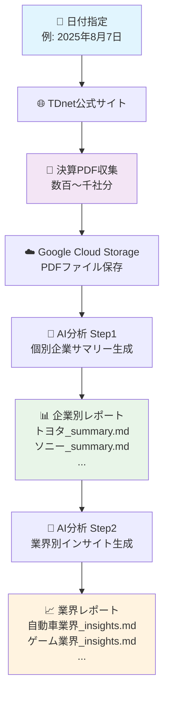

# TDnet Scraper for Google Cloud

日本株の適時開示情報（TDnet）から決算短信・配当関連資料等のPDFドキュメントを自動取得し、**Vertex AI Gemini LLM**による高度なテキスト分析で**個別企業サマリー**と**セクター別インサイト**を生成するシステムです。Cloud SchedulerとCloud Functions（Gen2）を用いて日次で自動実行されます。また、任意の日付を指定して手動で実行することも可能です。

## 🎯 何ができるの？

このシステムは**日本の上場企業の決算資料を自動で収集・分析して、投資に役立つレポートを生成**します。

### 📊 **具体例で理解しよう**

**例：2025年8月7日の決算発表を分析したい場合**

1. **📥 データ収集** → トヨタ、ソニー、任天堂など数百社の決算PDF を自動ダウンロード
2. **🤖 AI分析** → 各企業の業績・戦略をAIが要約
3. **📈 業界分析** → 自動車業界、エンターテイメント業界など、業界ごとの勝ち組・負け組を特定

### 🔄 **処理の流れ（3ステップ）**



### 💡 **こんな人におすすめ**

- 📈 **個人投資家**: 業界トレンドや企業比較を効率的に把握したい
- 🏦 **金融アナリスト**: 大量の決算資料を自動で分析したい  
- 📊 **投資ファンド**: セクター分析の効率化を図りたい
- 🎓 **研究者**: 日本企業の定量分析データが欲しい

### ⚡ **主な特徴**

| 特徴 | 説明 | メリット |
|------|------|----------|
| 🚀 **全自動** | 毎日19時にデータ収集を自動実行 | 手動作業ゼロ |
| 🧠 **AI分析** | Gemini 2.5 Flash Liteで高精度分析 | 人間レベルの洞察 |
| ⚡ **高速処理** | 25並列でAI分析、20並列でダウンロード | 数百社を数分で処理 |
| 📱 **すぐ使える** | Markdownレポートで読みやすい | コピペで投資レポート完成 |
| 🎯 **賢いフィルタ** | 大型株は詳細、小型株はコンパクト分析 | 最適な情報密度 |
| 🏷️ **業界分類** | 33業種×4規模で自動グループ分け | 投資戦略に直結 |

## システム構成

本システムはGoogle Cloud Platform上に構築されており、以下のコンポーネントで構成されています。

- **Cloud Functions (Gen2)**: 単一の関数 `trigger_scraper` がメインのエントリーポイントとして機能します。Cloud Schedulerまたは直接のHTTPリクエストによってトリガーされ、対応するPythonスクリプトを実行することで、さまざまなタスク（`scrape`, `summary`, `insights`）を制御します。
- **Cloud Scheduler**: Cloud Functionを毎日トリガーして、スクレイピングタスクを実行するジョブをスケジュールします。
- **Google Cloud Storage (GCS)**: 取得したPDFドキュメント、個別サマリー、最終的なセクターインサイトレポートを保存します。
- **Vertex AI Gemini 2.5 Flash Lite**: PDFから抽出したテキストを直接分析し、企業別サマリーとセクター別インサイトを生成するLLMエンジンです。

このサーバーレスアーキテクチャは、実行中にのみリソースを消費するため、コスト効率に優れています。

## プロジェクト構造

```
tdnet-scraper/
├── 📁 config/                    # 設定ファイル
│   ├── config.yaml              # メイン設定（LLM、GCS、スクレイピング設定）
│   └── config-test.yaml         # テスト用設定（削除予定）
├── 📁 inputs/                   # 入力データ
│   └── companies.csv            # 企業一覧（33業種区分、規模区分含む）
├── 📁 prompt_templates/         # LLMプロンプト定義
│   ├── summary_system_prompt.md    # 個別サマリー用（大型株・詳細版）
│   ├── summary_system_prompt_small.md # 個別サマリー用（小型株・コンパクト版）
│   ├── summary_user_prompt.md      # 個別サマリー用ユーザープロンプト
│   ├── sector_system_prompt.md     # セクターインサイト用システムプロンプト
│   └── sector_user_prompt.md       # セクターインサイト用ユーザープロンプト
├── 📁 keys/                     # 認証鍵（ローカル開発用）
│   └── *.json                   # Google Cloud サービスアカウント鍵
├── 📁 logs/                     # ログファイル
├── 📁 downloads/                # GCSからのダウンロード用ディレクトリ
│
├── 🐍 **メインスクリプト**
│   ├── main.py                  # Cloud Functions エントリーポイント
│   ├── tdnet_cloud.py          # TDnetスクレイピング・GCSアップロード
│   ├── generate_summary.py     # 個別サマリー生成（LLM処理）
│   └── generate_sector_insights.py # セクターインサイト生成（LLM処理）
│
├── 🔧 **ユーティリティ**
│   ├── constants.py            # 共通定数・関数（証券コード正規化等）
│   ├── tdnet_base.py          # TDnetスクレイピング基盤クラス
│   ├── gcs_download.py        # GCS→ローカルダウンロードツール
│   └── analyze_companies.py   # 企業データ分析ツール
│
├── 🚀 **デプロイ・設定**
│   ├── deploy.sh              # Cloud Functions デプロイスクリプト
│   ├── deploy.env            # デプロイ用環境変数
│   ├── requirements.txt      # ローカル開発用依存関係
│   ├── requirements-functions.txt # Cloud Functions用依存関係
│   └── .gcloudignore        # Cloud デプロイ除外ファイル指定
│
└── 📚 **ドキュメント**
    ├── README.md             # プロジェクト概要・使用方法
    ├── GET_STARTED.md        # セットアップガイド
    ├── SYSTEM_REQUIREMENTS.md # 詳細仕様・要件定義
    └── additional_requirements.md # 追加要件
```

### 🐍 Pythonファイル詳細

#### **メインスクリプト**

- **`main.py`** (242行)
  - Cloud Functions のHTTPエントリーポイント
  - タスク判定（`scrape` / `summary` / `insights`）
  - 対応するPythonスクリプトをサブプロセス実行
  - 日付の自動取得（JST）とパラメータ解析

- **`tdnet_cloud.py`** (555行)
  - TDnetサイトのスクレイピング実行
  - PDF文書のダウンロード・分類（決算短信/配当/その他）
  - 市場フィルタリング（ETF、REITs等除外）
  - GCSへの並列アップロード（20スレッド）
  - メタデータJSONファイル生成

- **`generate_summary.py`** (422行)
  - 個別企業サマリー生成（証券コード単位）
  - 規模区分による自動プロンプト選択（大型株: 詳細版、小型株: コンパクト版）
  - PDF→テキスト抽出（PyMuPDF/pypdf）
  - Vertex AI Gemini 2.5 Flash Lite による並列LLM処理（25スレッド）
  - GCSへの結果保存（`insights-summaries/`）

- **`generate_sector_insights.py`** (163行)
  - セクター別インサイト生成（33業種×規模区分）
  - 個別サマリーの読み込み・グループ化
  - 4ステップ構造化分析フレームワーク実行
  - Vertex AI による並列処理
  - GCSへの結果保存（`insights-sectors/`）

#### **ユーティリティ**

- **`constants.py`** (159行)
  - 証券コード正規化関数
  - 共通定数・設定値定義
  - データ変換ユーティリティ

- **`tdnet_base.py`** (329行)
  - TDnetスクレイピングの基盤クラス
  - HTMLパース・データ抽出ロジック
  - 再利用可能なスクレイピング機能

- **`gcs_download.py`** (48行)
  - GCSからローカルへのデータダウンロード
  - 検証・確認用ツール

- **`analyze_companies.py`** (24行)
  - 企業データ分析・統計出力
  - 市場区分の重複チェック

## ローカルでの実行方法

スクレイパーとインサイト生成スクリプトは、ローカル環境でも実行できます。

- **前提条件**:
  - Python 3.11
  - `pip install -r requirements.txt`
  - Google Cloud認証の設定（例: `gcloud auth application-default login` または `GOOGLE_APPLICATION_CREDENTIALS` の設定）。

- **実行コマンド**:
  ```bash
  # スクレイピング実行
  python tdnet_cloud.py --date 20250807
  
  # 個別サマリー生成
  export GOOGLE_APPLICATION_CREDENTIALS="keys/<YOUR_SERVICE_ACCOUNT_KEY>.json"
  python generate_summary.py --date 20250807 --bucket tdnet-documents --base vertex-ai-rag --project <YOUR_PROJECT_ID>
  
  # セクターインサイト生成
  python generate_sector_insights.py --date 20250807 --bucket tdnet-documents --base vertex-ai-rag --project <YOUR_PROJECT_ID>
  
  # その他のオプション例
  python generate_summary.py --date 20250807 --project <YOUR_PROJECT_ID> --max-files 10  # テスト用（10ファイルのみ処理）
  ```

## デプロイ

このアプリケーションは、Gen2のCloud Functionとしてデプロイされます。`deploy.sh`スクリプトが、環境変数の設定やリソースの構成を含むデプロイプロセス全体を管理します。

## デプロイ

1) サービスアカウントでログイン（任意）

```bash
gcloud auth activate-service-account --key-file=keys/<YOUR_SA_KEY>.json
gcloud config set project stock-383203
```

2) `inputs/companies.csv` がある場合はリポジトリに含めたままデプロイ（Cloud Functionsに同梱されます）

3) デプロイ（Cloud Functions + Scheduler）

```bash
./deploy.sh
```

### Cloud Schedulerの時間を変更する
- 例: 毎日 7:30 JST に変更
```bash
REGION=asia-northeast1
SCHEDULER_NAME=tdnet-scrape-daily
CRON="0 19 * * *"
FUNCTION_URL=$(gcloud functions describe tdnet-scraper --region=$REGION --gen2 --format='value(serviceConfig.uri)')
gcloud scheduler jobs update http $SCHEDULER_NAME \
  --schedule="$CRON" \
  --time-zone="Asia/Tokyo" \
  --uri="$FUNCTION_URL" \
  --http-method=POST \
  --location=$REGION
```
- ワンライナー例（毎日0:05 JST）
```bash
gcloud scheduler jobs update http tdnet-scrape-daily --schedule="0 19 * * *" --time-zone="Asia/Tokyo" --location=asia-northeast1 --uri="$(gcloud functions describe tdnet-scraper --region=asia-northeast1 --gen2 --format='value(serviceConfig.uri)')"
```
- 補足
  - CRONは`min hour day month weekday`形式
  - タイムゾーンは`Asia/Tokyo`（任意で変更可）

## 実行方法（本番）

### 自動実行（推奨）
Cloud Schedulerにより以下のタスクが自動実行されます：

- **19:00 JST**: スクレイピング（`task=scrape`）- 当日のTDnetデータを自動取得・GCS保存

**注意**: 個別サマリー生成（`task=summary`）とセクターインサイト生成（`task=insights`）は手動実行が必要です。

### 手動実行

**重要**: 手動実行では必ず日付を明示的に指定してください。

#### 1. gcloud コマンドライン経由（推奨）

```bash
# スクレイピング実行（日付必須）
gcloud functions call tdnet-scraper --region asia-northeast1 --data='{"task":"scrape","date":"20250807"}'

# 個別サマリー生成（日付必須）
gcloud functions call tdnet-scraper --region asia-northeast1 --data='{"task":"summary","date":"20250807"}'

# セクターインサイト生成（日付必須）
gcloud functions call tdnet-scraper --region asia-northeast1 --data='{"task":"insights","date":"20250807"}'
```

#### 2. 自動実行（Cloud Scheduler）

Cloud Schedulerは日付指定なしで実行され、自動的に当日のJST日付を使用：

```json
{"task":"scrape"}  // 当日日付を自動取得
```

#### 3. HTTP リクエスト経由（内部専用）

**注意**: Cloud Functionsは内部専用設定のため、外部からの直接アクセスは不可能です。

```bash
# スクレイピング実行（JSON・日付必須）
curl -X POST -H 'Content-Type: application/json' \
  -d '{"task":"scrape","date":"20250807"}' \
  <INTERNAL_FUNCTION_URL>

# クエリパラメータ（日付必須）
curl -X POST "<INTERNAL_FUNCTION_URL>?task=scrape&date=20250807"
```

#### 4. タスクパラメータ説明

- **`task=scrape`**: TDnetからPDFファイルをスクレイピングしてGCSに保存
- **`task=summary`**: GCS内のPDFから個別サマリーを生成（LLM処理）
- **`task=insights`**: 個別サマリーからセクター別インサイトを生成（LLM処理）
- **`date=YYYYMMDD`**: 処理対象の日付（省略時は当日JST）

## GCS出力構造

### PDFファイル
```
gs://tdnet-documents/vertex-ai-rag/
├── 2025/08/07/
│   ├── 60620_tanshin.pdf
│   ├── 60620_presentation.pdf
│   └── ...
```

### 個別サマリー
```
gs://tdnet-documents/vertex-ai-rag/insights-summaries/
├── 20250807/
│   ├── 20250807_サービス業_Small_2_60620_summary.md
│   ├── 20250807_情報通信業_Core30_37880_summary.md
│   └── ...
```

### セクターインサイト
```
gs://tdnet-documents/vertex-ai-rag/insights-sectors/
├── 20250807/
│   ├── サービス業_Small_2_insights.md
│   ├── 情報通信業_Core30_insights.md
│   └── ...
```

## ローカルでのGCSダウンロード

```bash
export GOOGLE_APPLICATION_CREDENTIALS="keys/<YOUR_SERVICE_ACCOUNT_KEY>.json"
python gcs_download.py --date 20250807 --out downloads
```

## 設定ファイル管理

- **`config/config.yaml`**: アプリケーション設定（GCS、LLM、スクレイピング設定）
- **`deploy.env`**: Cloud Functions リソース設定（メモリ、タイムアウト、インスタンス数）
- **`prompt_templates/`**: LLMプロンプトテンプレート（システム・ユーザープロンプト分離）

```bash
# 設定例（deploy.env）
TDNET_MEMORY="512Mi"
TDNET_TIMEOUT="1500s"
TDNET_MAX_INSTANCES="1"
```

## 市場一覧の重複排除と除外設定の調整

```bash
python analyze_companies.py --csv inputs/companies.csv
# 必要に応じて constants.py の EXCLUDED_MARKETS_DEFAULT を更新
```

## ログ

- Cloud Functionsの標準出力に、開始/完了・各ファイルの成功/失敗（証券コード、ドキュメント種別、タイトル、GCSパス）をINFOで出力
- 72時間で自動的に削除（_Default バケットの保持期間を3日に設定）

## セキュリティ

**重要**: 本システムは以下のセキュリティ対策を実装しています：

- **Cloud Functions**: `internal-only` + 認証必須（外部からの直接アクセス不可）
- **実行方法**: Cloud Scheduler経由のみ許可
- **デプロイ設定**: `--ingress-settings=internal-only --no-allow-unauthenticated`
- **アクセステスト**: オープンインターネットからアクセスすると404エラーが返される

## 注意事項

- 本実装はPDFを一時ファイルへ保存後にGCSへアップロードします（大容量PDFでのメモリ過負荷を避ける設計）
- 利用規約やアクセス制限に従い、適切なレート制御を維持してください（本実装はスレッド単位で1秒5リクエスト上限）

### 市場フィルタリング

`inputs/companies.csv` を用いて、特定市場の銘柄（例: ETF, ETN, PRO Market, REITs, 外国株など）の開示文書をスクレイピング対象から除外します。これにより、不要な文書のダウンロードやGCSへのアップロードを防ぎ、処理の効率化と関連性の高いデータのみの収集を実現します。

**変更点と修正内容:**

- **銘柄コード正規化の改善**: `constants.py` の `normalize_code` 関数を拡張し、5桁の数字コード（例: `13264`）で末尾が0でなくても最後の桁を削除するように修正しました。これにより、`13264` は `1326` に、`13494` は `1349` に正規化され、`inputs/companies.csv` 内のETFなどの除外対象銘柄と正しくマッチするようになりました。
- **GCSファイルパスの最適化**: `gcs_download.py` の `--out` パラメータの指定を調整し、日付が二重にネストされることなく、期待通りのフラットなGCSパス構造 `vertex-ai-rag/YYYY/MM/DD/company_code_filename.pdf` となるようにしました。

### Cloud Scheduler での実行設定

毎日UTC午前1時（日本時間午前10時）にスクレイピングを実行するCloud Schedulerジョブを設定しています。

スケジュールの変更は、以下の`gcloud`コマンドで可能です。CRON式を適宜変更してください。

---

