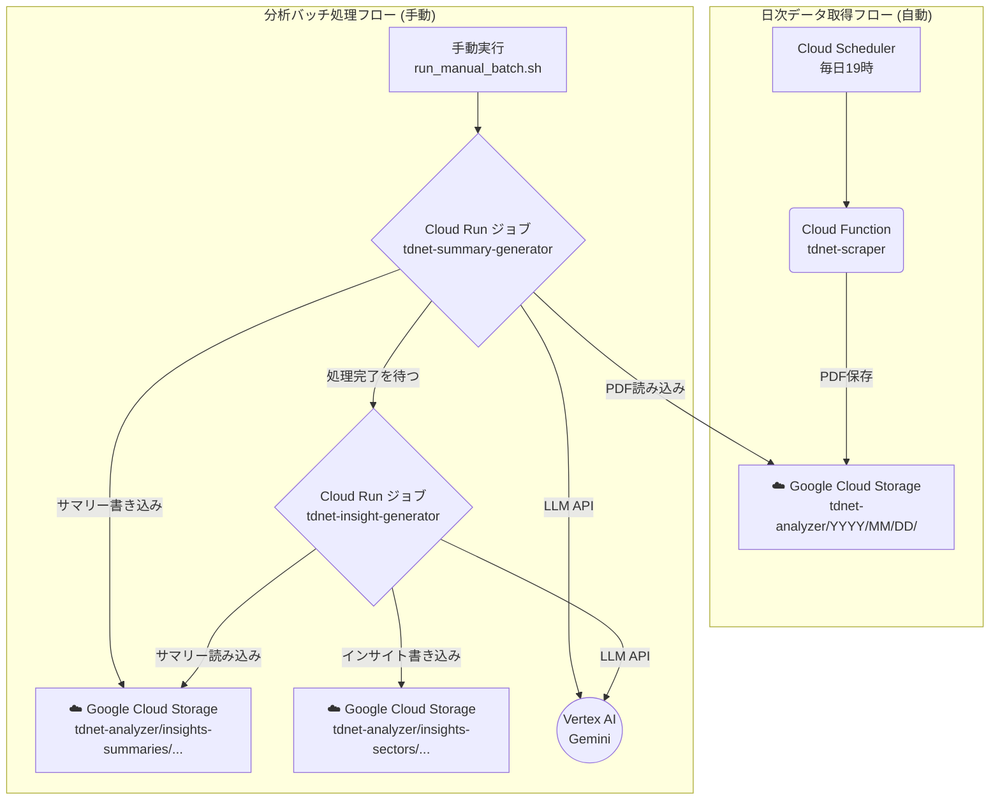

# TDnet Analyzer for Google Cloud

本システムは、日本取引所グループが提供する適時開示情報閲覧サービス（TDnet）から企業の開示資料（PDF）を自動的に収集し、Google CloudのVertex AI Geminiモデルを利用して、指定された分析レポートを生成する一連のツール群です。

日次でのデータ収集を自動化するとともに、任意の期間を指定して分析バッチを実行する機能を備えています。生成されるレポートは、個別企業のファンダメンタルズ分析や、セクター単位での市場動向把握を支援することを目的としています。

コアコンポーネントはサーバーレスアーキテクチャ（Cloud Functions, Cloud Run）で構築されており、処理実行時のみ課金されるため、コスト効率に優れた運用が可能です。

## 主な機能

- **日次データ自動収集:** Cloud SchedulerとCloud Functionにより、毎日定時にTDnetから最新の開示資料PDFをGCS（Google Cloud Storage）に保存します。
- **オンデマンド分析バッチ処理:** Cloud Runジョブを利用し、指定した期間の収集済みPDFを対象として、以下の2種類の分析レポートを生成します。
  1. **個別企業サマリー**
  2. **セクター別インサイト**

## アーキテクチャ

本システムは、以下の2つの独立した処理フローから構成されます。

1. **日次データ取得フロー（自動実行）**
2. **分析バッチ処理フロー（手動実行）**



### コンポーネント

- **Cloud Functions**: 日次スクレイピング。
- **Cloud Run ジョブ**: サマリー生成・セクターインサイト生成（最大60分）。
- **GCS**: PDF・サマリー・インサイトの保存。
- **Vertex AI**: LLM推論。
- **Cloud Scheduler**: `tdnet-scraper` を毎日実行。

### 重要: パスと配置規約（相対パスの安定化）
- すべてのスクリプトはパッケージ `tdnet_analyzer/` に集約しました。
- 相対パスで参照する `config/`, `inputs/`, `prompt_templates/` などは、共通の `tdnet_analyzer.common.path_utils.project_path()` を通じてプロジェクトルートから解決します。
- これにより、Cloud Functions／Cloud Run／ローカルのいずれでも、配置に依存せずに正しくファイルを解決します。

## プロジェクト構成

```
tdnet-analyzer/
├── 📁 tdnet_analyzer/
│   ├── 📁 common/                 # 共通
│   │   ├── path_utils.py         # ルート解決 (project_path)
│   │   └── constants.py          # 定数・CSVローダ
│   ├── 📁 scraper/                # スクレイパー
│   │   ├── tdnet_base.py
│   │   └── tdnet_cloud.py        # Cloud Functions/CLIエントリ (モジュール実行)
│   ├── 📁 batch/                  # バッチ (Cloud Run)
│   │   ├── generate_summary.py
│   │   └── generate_sector_insights.py
│   └── 📁 tools/                  # 補助ツール
│       ├── gcs_download.py
│       └── analyze_companies.py
│
├── 📁 config/                     # 設定
│   └── config.yaml
├── 📁 inputs/                     # 入力（CSV等）
│   └── companies.csv
├── 📁 prompt_templates/           # プロンプト
│   ├── summary_system_prompt.md
│   ├── summary_system_prompt_small.md
│   ├── summary_user_prompt.md
│   ├── sector_system_prompt.md
│   └── sector_user_prompt.md
├── 📁 keys/                       # 認証鍵（ローカルのみ）
├── 📁 logs/                       # ローカルログ
├── 📁 downloads/                  # GCSダウンロード先
│
├── main.py                        # [CF] HTTPエントリ (パッケージモジュールを起動)
├── Dockerfile                     # Cloud Runコンテナ
├── deploy.sh                      # デプロイ
├── run_manual_batch.sh            # 手動バッチ実行
├── run_scraper_via_scheduler.sh   # 安全な手動スクレイピング
├── requirements.txt
├── requirements-functions.txt
├── README.md / GET_STARTED.md / SYSTEM_REQUIREMENTS.md
```

## 使い方

### 1. デプロイ

```bash
chmod +x deploy.sh run_manual_batch.sh run_scraper_via_scheduler.sh
./deploy.sh --key-file keys/<YOUR_SERVICE_ACCOUNT_KEY>.json --project-id <YOUR_PROJECT_ID>
```

### 2. 分析バッチの手動実行

```bash
./run_manual_batch.sh \
  --start-date 20230101 --end-date 20230107 \
  --key-file keys/<YOUR_SERVICE_ACCOUNT_KEY>.json \
  --project-id <YOUR_PROJECT_ID>
```

### 3. 手動スクレイピング（安全）

```bash
./run_scraper_via_scheduler.sh --date 20240101 \
  --key-file keys/<YOUR_SERVICE_ACCOUNT_KEY>.json \
  --project-id <YOUR_PROJECT_ID>
```

### 4. ローカル実行（デバッグ）

```bash
export GOOGLE_APPLICATION_CREDENTIALS="keys/<YOUR_SERVICE_ACCOUNT_KEY>.json"
# スクレイピング
python -m tdnet_analyzer.scraper.tdnet_cloud --date 20230101
# サマリー
python -m tdnet_analyzer.batch.generate_summary --start-date 20230101 --end-date 20230101
# セクター
python -m tdnet_analyzer.batch.generate_sector_insights --start-date 20230101 --end-date 20230101
```