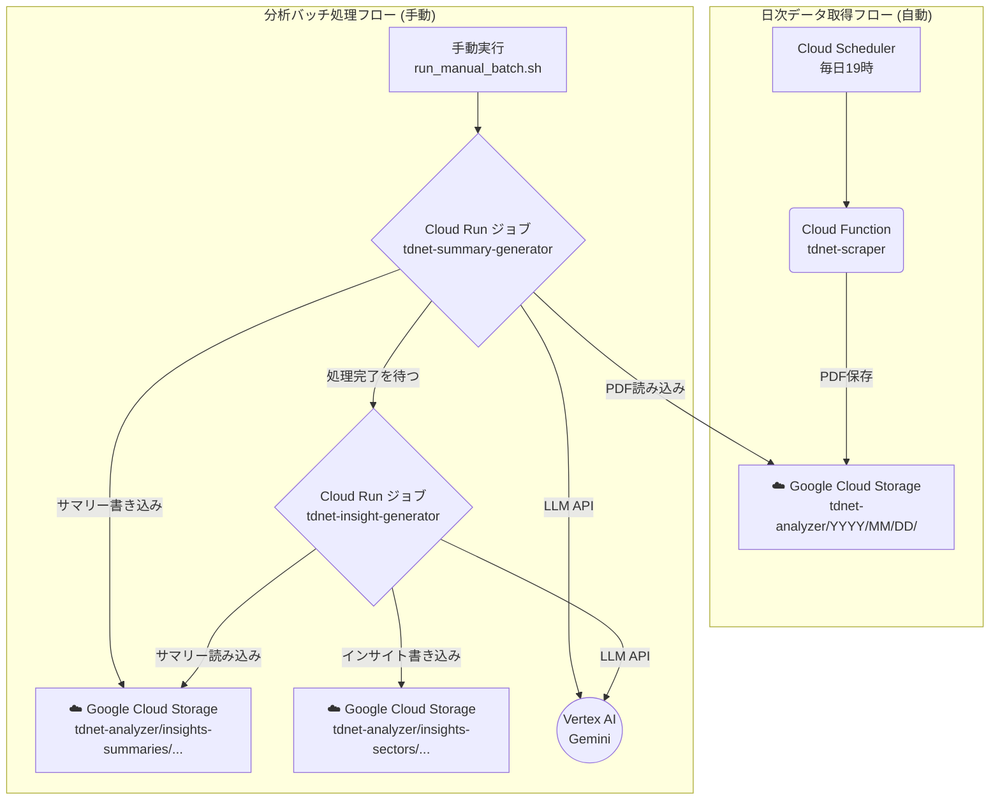

# TDnet Analyzer for Google Cloud

日本株の適時開示情報（TDnet）から決算短信・配当関連資料等のPDFドキュメントを自動取得し、**Vertex AI Gemini LLM**による高度なテキスト分析で**個別企業サマリー**と**セクター別インサイト**を生成するシステムです。Cloud SchedulerとCloud Functions（Gen2）を用いて日次で自動実行されます。また、任意の日付を指定して手動で実行することも可能です。

## 🎯 何ができるの？

このシステムは**日本の上場企業の決算資料を自動で収集・分析して、投資に役立つレポートを生成**します。

### 📊 **具体例で理解しよう**

**例：2025年8月7日の決算発表を分析したい場合**

1. **📥 データ収集** → トヨタ、ソニー、任天堂など数百社の決算PDF を自動ダウンロード
2. **🤖 AI分析** → 各企業の業績・戦略をAIが要約
3. **📈 業界分析** → 自動車業界、エンターテイメント業界など、業界ごとの勝ち組・負け組を特定

### 💡 **こんな人におすすめ**

- 📈 **個人投資家**: 業界トレンドや企業比較を効率的に把握したい
- 🏦 **金融アナリスト**: 大量の決算資料を自動で分析したい  
- 📊 **投資ファンド**: セクター分析の効率化を図りたい
- 🎓 **研究者**: 日本企業の定量分析データが欲しい

### ⚡ **主な特徴**

| 特徴 | 説明 | メリット |
|------|------|----------|
| 🚀 **全自動** | 毎日19時にデータ収集を自動実行 | 手動作業ゼロ |
| 🧠 **AI分析** | Gemini LLMで高精度分析 | 人間レベルの洞察 |
| ⚡ **堅牢なバッチ処理** | Cloud Run ジョブで長時間処理に対応 | 大量データを安定処理 |
| 📱 **すぐ使える** | Markdownレポートで読みやすい | コピペで投資レポート完成 |
| 🎯 **賢いフィルタ** | 大型株は詳細、小型株はコンパクト分析 | 最適な情報密度 |
| 🏷️ **業界分類** | 33業種×4規模で自動グループ分け | 投資戦略に直結 |

## アーキテクチャ

本システムは、以下の2つの独立した処理フローから構成されます。

1.  **日次データ取得フロー（自動実行）**: 毎日定時にCloud SchedulerがCloud Functionを起動し、その日のTDnet開示PDFをGCSに収集・保存します。
2.  **分析バッチ処理フロー（手動実行）**: ユーザーが手動でスクリプトを実行すると、Cloud Runジョブが起動し、指定された期間のPDFを対象に、サマリー生成とインサイト抽出を順番に実行します。



### コンポーネント

-   **Cloud Functions**: サーバーレスの実行環境。日次のTDnet PDF収集という、軽量で定期的なタスクを担当します。
-   **Cloud Run ジョブ**: コンテナ化されたバッチ処理を実行するサーバーレス環境。サマリー生成やインサイト抽出といった、最大60分の実行時間が必要となる、計算負荷の高いタスクを担当します。
-   **Google Cloud Storage (GCS)**: 取得したPDFドキュメント、個別サマリー、最終的なセクターインサイトレポートを保存します。
-   **Vertex AI (Gemini)**: PDFの内容を理解し、高品質なサマリーとインサイトを生成するための大規模言語モデル。
-   **Cloud Scheduler**: `tdnet-scraper` Cloud Functionを毎日定時に起動するためのトリガー。

### コストに関する注記

本システムは、日々の運用コストを最小限に抑えるように設計されています。低コストを実現している主な理由は以下の通りです。

*   **サーバーレスアーキテクチャ:**
    コア機能はGoogle Cloud FunctionsおよびCloud Run上で実行されます。これはサーバーレスのコンピューティングサービスであり、コードが実行されている時間だけ課金されます。サーバーを常時稼働させる必要がないため、待機コストは一切かかりません。

*   **費用対効果の高いLLM:**
    分析には、GoogleのVertex AIが提供する大規模言語モデルを利用しています。

*   **無料利用枠の活用:**
    Google Cloud Platformの各サービス（Cloud Functions, Cloud Storage, Vertex AI, Cloud Scheduler, Cloud Run）には、一定量までの利用が無料となる「無料利用枠」が設定されています。本システムは1日1回、短時間実行されるバッチ処理が中心のため、多くのケースでこの無料枠の範囲内に収まり、**月額費用がほぼゼロになる可能性**があります。

> ※注意: 将来的に処理対象の企業数を大幅に増やしたり、より高機能なLLMモデルに変更した場合は、別途コストが発生します。詳細は[Google Cloudの料金計算ツール](https://cloud.google.com/products/calculator)をご参照ください。

## プロジェクト構成

```
tdnet-analyzer/
├── 📁 config/                    # 設定ファイル
│   └── config.yaml              # メイン設定（LLM、GCS、スクレイピング設定）
├── 📁 inputs/                   # 入力データ
│   └── companies.csv            # 企業一覧（33業種区分、規模区分含む）
├── 📁 prompt_templates/         # LLMプロンプト定義
│   ├── summary_system_prompt.md
│   ├── summary_system_prompt_small.md
│   ├── summary_user_prompt.md
│   ├── sector_system_prompt.md
│   └── sector_user_prompt.md
├── 📁 keys/                     # 認証鍵（ローカル開発用）
│   └── *.json                   # Google Cloud サービスアカウント鍵
├── 📁 logs/                     # ログファイル
├── 📁 downloads/                # GCSからのダウンロード用ディレクトリ
│
├── 🐍 **メインスクリプト**
│   ├── main.py                  # [CF] 日次スクレイピング用エントリーポイント
│   ├── tdnet_cloud.py           # TDnetスクレイピング・GCSアップロード
│   ├── generate_summary.py      # [CR] 個別サマリー生成（LLM処理）
│   └── generate_sector_insights.py # [CR] セクターインサイト生成（LLM処理）
│
├── 🔧 **ユーティリティ**
│   ├── constants.py             # 共通定数・関数（証券コード正規化等）
│   ├── tdnet_base.py            # TDnetスクレイピング基盤クラス
│   ├── gcs_download.py          # GCS→ローカルダウンロードツール
│   └── analyze_companies.py     # 企業データ分析ツール
│
├── 🚀 **デプロイ・実行**
│   ├── Dockerfile               # Cloud Run用コンテナ定義
│   ├── deploy.sh                # Cloudリソースのデプロイスクリプト
│   ├── run_manual_batch.sh      # 分析バッチの手動実行スクリプト
│   ├── deploy.env               # デプロイ用環境変数
│   ├── requirements.txt         # ローカル開発用依存関係
│   └── requirements-functions.txt # Cloud Function/Cloud Run用依存関係
│
└── 📚 **ドキュメント**
    ├── README.md                # プロジェクト概要・使用方法
    ├── GET_STARTED.md           # セットアップガイド
    └── SYSTEM_REQUIREMENTS.md   # 詳細仕様・要件定義
```

### 🐍 Pythonファイル詳細

#### **メインスクリプト**

- **`main.py`**
  - Cloud Functions のHTTPエントリーポイント (`tdnet-scraper`)。
  - Cloud Schedulerからトリガーされ、`tdnet_cloud.py`をサブプロセスとして実行し、日次のスクレイピングタスクを行います。

- **`tdnet_cloud.py`**
  - TDnetサイトのスクレイピング実行
  - PDF文書のダウンロード・分類（決算短信/配当/その他）
  - 市場フィルタリング（ETF、REITs等除外）
  - GCSへの並列アップロード
  - メタデータJSONファイル生成

- **`generate_summary.py`**
  - Cloud Runジョブ (`tdnet-summary-generator`)として実行される。
  - 指定された期間のPDFをGCSから読み込み、個別企業サマリーを生成します。
  - 規模区分による自動プロンプト選択（大型株: 詳細版、小型株: コンパクト版）
  - Vertex AI Gemini によるLLM処理
  - GCSへの結果保存（`insights-summaries/`）

- **`generate_sector_insights.py`**
  - Cloud Runジョブ (`tdnet-insight-generator`)として実行される。
  - 指定された期間の個別サマリーを読み込み、セクター別インサイトを生成します。
  - 4ステップ構造化分析フレームワーク実行
  - GCSへの結果保存（`insights-sectors/`）

## 使い方

### 1. デプロイ

最初に一度だけ、`deploy.sh`を実行してGoogle Cloudに必要なリソース（Cloud Function, Cloud Runジョブ, Cloud Scheduler等）をすべて構築します。

```bash
# スクリプトに実行権限を付与（初回のみ）
chmod +x deploy.sh run_manual_batch.sh

# サービスアカウントキーを指定してデプロイスクリプトを実行
./deploy.sh keys/<YOUR_SERVICE_ACCOUNT_KEY>.json
```
これにより、日次のPDF自動収集が有効になります。

### 2. 分析バッチの手動実行

任意のタイミングで、過去の指定した期間のPDFを分析し、サマリーとインサイトを生成することができます。

```bash
# 2023年1月1日から1月7日までのデータを対象に分析バッチを実行
./run_manual_batch.sh --start-date 20230101 --end-date 20230107
```
このスクリプトは、サマリー生成ジョブの完了を待ってから、インサイト生成ジョブを自動で実行します。処理の進捗はターミナルに表示されます。

### 3. ローカルでの実行（デバッグ用）

個別のスクリプトをローカル環境で実行して、部分的な動作確認やデバッグを行うことも可能です。

- **前提条件**:
  - Python 3.11
  - `pip install -r requirements.txt`
  - Google Cloud認証の設定（`GOOGLE_APPLICATION_CREDENTIALS` 環境変数にサービスアカウントキーのパスを設定）。

- **実行コマンド**:
  ```bash
  # サービスアカウントキーのパスを設定
  export GOOGLE_APPLICATION_CREDENTIALS="keys/<YOUR_SERVICE_ACCOUNT_KEY>.json"

  # スクレイピング実行
  python tdnet_cloud.py --date 20230101

  # 個別サマリー生成
  python generate_summary.py --start-date 20230101 --end-date 20230101

  # セクターインサイト生成
  python generate_sector_insights.py --start-date 20230101 --end-date 20230101
  ```