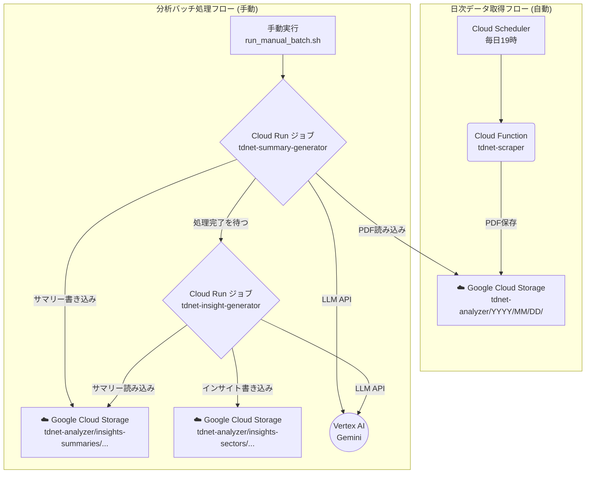

# TDnet Scraper 要件書

この文書は、本システムのユーザ要件およびシステム要件を記述します。これをインプットに、別の実装者/AIが同等システムを構築できることを目的とします。

## 1. ユーザ要件

- 目的: TDnetから対象（決算短信、配当関連、その他重要文書等）のPDFを取得し、GCSへ保存。Vertex AI Gemini LLMによる分析のためのデータを日次蓄積する。
- 実行方式:
  - 日次自動実行（**JST 19:00**）
  - 任意期間の手動バッチ実行に対応
  - ローカルでGCSから日付配下の成果物をダウンロードできること（検証・再処理用途）
- 成果物:
  - PDFファイル
  - 個別企業サマリー（Markdown形式）
  - セクター別インサイト（Markdown形式）
- 保存先構造:
  - PDF: `tdnet-analyzer/{YYYY}/{MM}/{DD}/{company_code}_{title}.pdf`
  - 個別サマリー: `tdnet-analyzer/insights-summaries/{YYYYMMDD}/{yyyymmdd}__{sector}__{size}__{code}__{company_name}_summary.md`
  - セクターインサイト: `tdnet-analyzer/insights-sectors/{YYYYMMDD}/{sector}__{size}_insights.md`
- パフォーマンス/コスト:
  - 大量（1000件超）でも実用時間（数分〜十数分）
  - 無駄な常時起動は不可。都度実行で終了、コスト最小化
  - メモリ使用を抑え、**1024MB**で安定動作
- 信頼性/安全性:
  - レート制御（1秒あたり最大5アクセス/スレッド）
  - 再試行（自動リトライ）は原則無効（事故コスト防止）
  - 失敗時も処理継続し、可能な限り多くを保存
- ログ:
  - INFOログで「証券コード・種別・タイトル・GCSパス」まで出す
  - 日付処理の完了ログ（保存件数）を出す
  - ログ保持は72時間、その後自動削除

## 2. システム要件

### 2.1 アーキテクチャ

本システムは、以下の2つの独立した処理フローから構成されるハイブリッドアーキテクチャを採用する。

1.  **日次データ取得フロー（自動実行）**: Cloud Function。Cloud Schedulerをトリガーとして、その日のTDnet開示PDFをGCSに収集・保存。
2.  **分析バッチ処理フロー（手動実行）**: Cloud Run ジョブ。ユーザーが手動で実行し、指定期間のPDFを対象にサマリー生成とインサイト抽出を順次実行。



### 2.2 実行環境

- **Cloud Function (`tdnet-scraper`)**
  - Runtime: Python 3.11, Timeout: 540s, Memory: 1Gi, Retries: 0
- **Cloud Run ジョブ**
  - Timeout: 3600s, Memory: 2Gi, CPU: 1, Tasks: 1, Retries: 0
- **Cloud Scheduler**
  - Schedule: `0 19 * * *` (JST 19:00)

### 2.3 依存関係管理
- `requirements.txt`: ローカル開発・デバッグ用。
- `requirements-functions.txt`: Cloud Functions/Run用。
- `Dockerfile`: `requirements-functions.txt` をベースにコンテナを構築。ENTRYPOINTは `python3`。

### 2.4 ディレクトリ/主要ファイル（パッケージ化後）
- `tdnet_analyzer/common/path_utils.py`: ルート解決ヘルパー（`project_path()`）。相対パス参照は原則ここ経由。
- `tdnet_analyzer/common/constants.py`: 企業CSVローダ、正規化関数。
- `tdnet_analyzer/scraper/tdnet_base.py`: スクレイピング基盤。
- `tdnet_analyzer/scraper/tdnet_cloud.py`: GCS保存/メタデータ作成。Cloud Functions/CLIエントリ（`-m`実行）。
- `tdnet_analyzer/batch/generate_summary.py`: 個別サマリー生成（`-m`実行）。
- `tdnet_analyzer/batch/generate_sector_insights.py`: セクターインサイト生成（`-m`実行）。
- `tdnet_analyzer/tools/gcs_download.py`: GCS→ローカル。
- `tdnet_analyzer/tools/analyze_companies.py`: 企業データ分析。
- `config/config.yaml`: 設定。
- `main.py`: Cloud Functions HTTPエントリ（パッケージモジュールをサブプロセス実行）。
- `deploy.sh`: デプロイ。
- `run_manual_batch.sh`: 手動バッチ実行。

### 2.5 パス設計（重要）
- すべてのファイル参照は `project_path()` を通じてルート起点で解決（`config/`, `inputs/`, `prompt_templates/`）。
- `__file__` からの相対参照や、作業ディレクトリ依存は使用しない。

### 2.4 スクレイピング設計
- HTTPクライアント: `requests`ライブラリを使用。セッション管理を行い、効率的な通信を実現。
- 文字エンコーディング: HTML解析時の文字化けを防ぐため、適切なエンコーディング（例: UTF-8）を適用。
- URL正規化: 相対URLを絶対URLに変換し、PDFダウンロードリンクの正確性を確保。
- 対象判断: 決算短信、配当関連、その他重要文書（別途リスト指定）を識別し、対象を絞り込む。
- 並列処理: `concurrent.futures.ThreadPoolExecutor`を用いたマルチスレッドでPDFダウンロードとGCSアップロードを並列化。
- レート制御: `time.sleep`やセマフォ等を用いて、TDnetへのアクセスが1秒あたり5リクエストを超えないよう制御。
- メモリ効率: PDFダウンロードはメモリに全量をロードせず、ストリーミングまたは一時ファイル経由でGCSへ直接アップロード。
- **市場フィルタリング**: `inputs/companies.csv`に基づき、ETF、ETN、PRO Market、REITs、外国株など、特定の市場に分類される銘柄の開示文書をスクレイピング対象から除外。
  - **修正内容**: `constants.py` の `normalize_code` 関数を拡張し、**5桁の数字コード（例: `13264`）で末尾が0でなくても最後の桁を削除するロジックを追加しました。これにより、`13264` は `1326` に、`13494` は `1349` に正規化され、`inputs/companies.csv` 内のETFなどの除外対象銘柄と正しくマッチするようになり、不要なファイルが除外されるようになりました。**

### 2.4.1 処理アルゴリズム（決定仕様・再現性担保）
1) 日付存在チェック: `GET https://www.release.tdnet.info/inbs/I_list_001_{YYYYMMDD}.html` が200以外なら即終了
2) ページ反復: `I_list_{page:03d}_{YYYYMMDD}.html` を1から順に取得し、データが空になった時点で打ち切り
3) HTML解析: 各行から `time, code, company_name, title, pdf_url` を抽出。`pdf_url`は絶対URLへ正規化
4) 対象判定: タイトルで対象文書を判定（決算短信/プレゼン/配当/その他）。非対象は除外
5) 市場フィルタ: `companies.csv`の `code→market` で照合し、初期除外市場に該当する銘柄を除外
6) バッチ処理: ページ内レコードをバッチ処理（規定 `batch_size=50`）。ページ内の残りも最後に処理
7) 並列実行: バッチ内は `max_workers` 並列で各ドキュメントを処理
   - レート制御: 各スレッド毎に1秒5アクセスのキュー制御
   - ダウンロード: `GET pdf_url`（timeout=30）。レスポンスはメモリ保持せず一時ファイルへ書き出し
   - アップロード: 一時ファイルを `GCS.upload_from_filename()` で転送後、即削除
8) 命名規則: ファイル名は `code + '_' + safe_title + '.pdf'`。`safe_title` は英数と`-_`のみ、空白は`_`、最大50文字
9) 保存レイアウト: 既定はフラット `gcs.base_path/YYYY/MM/DD/` 直下（`flat_per_day: true`）。未設定時は `.../{doc_type}/`
10) メタデータ: 最後にその日付の全データを再収集し、`metadata_{YYYYMMDD}.json` を保存
11) ログ: ページ/成功/失敗/除外件数/完了件数をINFOで記録。保持72時間
12) リトライ: 自動リトライなし（Scheduler/Functionsの設定として0）

### 2.6 設定スキーマ（必須/任意）
- `config/config.yaml` の項目（再現実装のための決定仕様）
```yaml
logging:
  level: "INFO"            # 必須: DEBUG/INFO/WARN/ERROR
  file: "logs/scraping.log" # 任意: ローカル実行時のみ

scraping:
  multithread:
    enabled: true           # 必須
    max_workers: 20         # 必須: PDFダウンロード用並列数
    timeout: 30             # 任意: PDFダウンロードの秒数

# companies.csv が存在すれば市場フィルタを適用
# 除外市場は `constants.EXCLUDED_MARKETS_DEFAULT` を用いる（要件に応じて編集可）

gcs:
  # GCSバケット名
  bucket_name: "tdnet-documents"
  # GCS内のベースパス
  base_path: "tdnet-analyzer"      # 必須
  # 1日配下をフラットに保存したい場合はtrue
  flat_per_day: true

llm:
  model_name: "gemini-2.5-flash-lite"
  parallel:
    max_workers: 25 # LLM呼び出し用並列数
```

### 2.7 実行モード（メモリ非蓄積の原則）
- 原則: ページ単位・ドキュメント単位のストリーミング処理。PDFのメモリ蓄積は禁止
- 任意の強化案（要件で指定する場合）:
  - 銘柄コード単位の分割実行（会社ごとにキューイングして逐次/並列処理）
  - 大容量タイトルのさらに厳密なチャンク書き出し（iter_content）

### 2.7 セキュリティ/IAM
- 実行サービスアカウントに最小権限（GCS書込）
- ローカル検証時はサービスアカウントキーを使用（環境変数 `GOOGLE_APPLICATION_CREDENTIALS`）

### 2.8 運用/運用フロー
- 日次: Scheduler→Functions。当日JSTで自動実行
- 任意日: `?date=YYYYMMDD` か JSON `{date:"YYYYMMDD"}` でHTTP POST
- 監視: Cloud Logging（72時間）

## 3. 品質目標
- 完了までの目標時間: 通常日 < 15分（データ量に依存）
- 失敗時継続率: 部分失敗でも全体は継続処理
- メモリ使用: 512MB内で安定

## 4. インターフェース定義
- HTTP（Cloud Functions）
  - Method: POST
  - Trigger: Cloud Scheduler (OIDC認証) または 認証済みgcloudコマンド
  - Query Parameter: `?date=YYYYMMDD`（任意）
    - 指定がない場合は、実行時のJST（Asia/Tokyo）の現在日付が使用される。
  - Body: なし
  - レスポンス: 成功時はステータスコード `200`、失敗時は `500`。

## 5. ディレクトリ/主要ファイル
- `main.py`: Cloud Functionsエントリポイント。date解釈と`tdnet_cloud.py`をサブプロセスとして実行。
- `tdnet_cloud.py`: GCS保存、並列処理、メタデータ作成（市場フィルタ、フラット保存対応）
- `tdnet_base.py`: 共通処理（HTTP, 解析, レート制御, ロギング）
- `generate_summary.py`: Cloud Runジョブで実行されるサマリー生成スクリプト。
- `generate_sector_insights.py`: Cloud Runジョブで実行されるインサイト生成スクリプト。
- `gcs_download.py`: GCSから日付配下をローカルへダウンロードし一覧を出力
- `constants.py`: 市場除外などの定数/辞書ローダ
- `analyze_companies.py`: `inputs/companies.csv`から市場の重複排除一覧を出力
- `config/config.yaml`: 設定（上記スキーマに準拠）
- `deploy.sh`: Cloud Function, Cloud Run ジョブ, Cloud Scheduler等のGCPリソースをデプロイする。
- `run_manual_batch.sh`: 分析バッチ処理（Cloud Run ジョブ）を手動で実行するスクリプト。
- `Dockerfile`: Cloud Run ジョブの実行環境となるコンテナイメージを定義する。

---
この要件書を満たす実装であれば、同等の機能・運用が可能です。 

## セキュリティ・IAM
- **アクセス制限**: Cloud Functions は `internal-only` + 認証必須設定
- **実行方法**: Cloud Scheduler経由のみ（外部からの直接アクセス不可）
- **セキュリティ設定**: `--ingress-settings=internal-only --no-allow-unauthenticated`
- **実行SA**: デプロイ時に`deploy.sh`が適切なサービスアカウントと権限を自動設定
- 本番は鍵不要（ADC）。ローカルは `GOOGLE_APPLICATION_CREDENTIALS=keys/<YOUR_SA_KEY>.json`

## Scheduler管理
- 既定: `0 19 * * *`（JST 19:00）
- 変更方法: `deploy.sh`で統合デプロイ（`deploy.env`で設定変更可能）

## 既知の注意点
- HEADは403になりやすいためGETで存在確認
- PDF相対URLの正規化
- 会社コードに英字/末尾0欠落のケースあり（CSVのコード文字列をそのままキーに使用） 