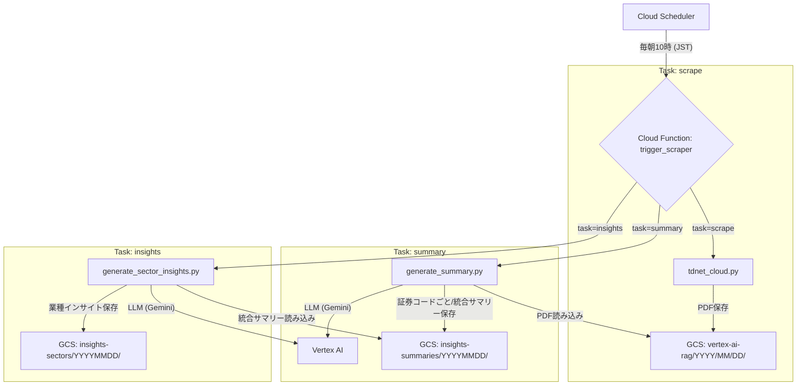

# TDnet Scraper 要件書

この文書は、本システムのユーザ要件およびシステム要件を記述します。これをインプットに、別の実装者/AIが同等システムを構築できることを目的とします。

## 1. ユーザ要件

- 目的: TDnetから対象（決算短信、配当関連、その他重要文書等）のPDFを取得し、GCSへ保存。Vertex AI Gemini LLMによる分析のためのデータを日次蓄積する。
- 実行方式:
  - 日次自動実行（JST 19:00）
  - 任意日付の手動実行にも対応（?date=YYYYMMDD または JSON body）
  - ローカルでGCSから日付配下の成果物をダウンロードできること（検証・再処理用途）
- 成果物:
  - PDFファイル
  - 日次メタデータJSON（件数や種類、会社別集計、個別ドキュメント情報）
- 保存先構造:
  - `vertex-ai-rag/{YYYY}/{MM}/{DD}/{document_type}/{company_code}_{title}.pdf`
  - `vertex-ai-rag/{YYYY}/{MM}/{DD}/metadata_{YYYYMMDD}.json`
- パフォーマンス/コスト:
  - 大量（1000件超）でも実用時間（数分〜十数分）
  - 無駄な常時起動は不可。都度実行で終了、コスト最小化
  - メモリ使用を抑え、512MBで安定動作
- 信頼性/安全性:
  - レート制御（1秒あたり最大5アクセス/スレッド）
  - 再試行（自動リトライ）は原則無効（事故コスト防止）
  - 失敗時も処理継続し、可能な限り多くを保存
- ログ:
  - INFOログで「証券コード・種別・タイトル・GCSパス」まで出す
  - 日付処理の完了ログ（保存件数）を出す
  - ログ保持は72時間、その後自動削除

## 2. システム要件

### 2.1 アーキテクチャ
- Cloud Scheduler → Cloud Functions（Gen2, HTTP）
- Cloud Functionsが同一コードベースの`tdnet_cloud.py`を直接起動し、全処理を完結
- 成果物はGCSへ保存

### 2.2 実行環境
- Cloud Functions（Gen2）設定:
  - Runtime: Python 3.11
  - Timeout: 3000s（50分）
  - Memory: 512MB
  - CPU: 1
  - Max instances: 1
  - Retries: 0
- ログ保持: Cloud Logging `_Default` バケット retention 3日

### 2.3 依存関係管理
- ローカル開発用: `requirements.txt`
- 本番（Cloud Functions）用: `requirements-functions.txt`
- デプロイ時のみ `requirements-functions.txt` を `requirements.txt` に一時差し替え、復元（`deploy.sh`）

### 2.4 スクレイピング設計
- HTTPクライアント: `requests`ライブラリを使用。セッション管理を行い、効率的な通信を実現。
- 文字エンコーディング: HTML解析時の文字化けを防ぐため、適切なエンコーディング（例: UTF-8）を適用。
- URL正規化: 相対URLを絶対URLに変換し、PDFダウンロードリンクの正確性を確保。
- 対象判断: 決算短信、配当関連、その他重要文書（別途リスト指定）を識別し、対象を絞り込む。
- 並列処理: `concurrent.futures.ThreadPoolExecutor`を用いたマルチスレッドでPDFダウンロードとGCSアップロードを並列化。
- レート制御: `time.sleep`やセマフォ等を用いて、TDnetへのアクセスが1秒あたり5リクエストを超えないよう制御。
- メモリ効率: PDFダウンロードはメモリに全量をロードせず、ストリーミングまたは一時ファイル経由でGCSへ直接アップロード。
- **市場フィルタリング**: `inputs/companies.csv`に基づき、ETF、ETN、PRO Market、REITs、外国株など、特定の市場に分類される銘柄の開示文書をスクレイピング対象から除外。
  - **修正内容**: `constants.py` の `normalize_code` 関数を拡張し、**5桁の数字コード（例: `13264`）で末尾が0でなくても最後の桁を削除するロジックを追加しました。これにより、`13264` は `1326` に、`13494` は `1349` に正規化され、`inputs/companies.csv` 内のETFなどの除外対象銘柄と正しくマッチするようになり、不要なファイルが除外されるようになりました。**

### 2.4.1 処理アルゴリズム（決定仕様・再現性担保）
1) 日付存在チェック: `GET https://www.release.tdnet.info/inbs/I_list_001_{YYYYMMDD}.html` が200以外なら即終了
2) ページ反復: `I_list_{page:03d}_{YYYYMMDD}.html` を1から順に取得し、データが空になった時点で打ち切り
3) HTML解析: 各行から `time, code, company_name, title, pdf_url` を抽出。`pdf_url`は絶対URLへ正規化
4) 対象判定: タイトルで対象文書を判定（決算短信/プレゼン/配当/その他）。非対象は除外
5) 市場フィルタ: `companies.csv`の `code→market` で照合し、初期除外市場に該当する銘柄を除外
6) バッチ処理: ページ内レコードをバッチ処理（規定 `batch_size=50`）。ページ内の残りも最後に処理
7) 並列実行: バッチ内は `max_workers` 並列で各ドキュメントを処理
   - レート制御: 各スレッド毎に1秒5アクセスのキュー制御
   - ダウンロード: `GET pdf_url`（timeout=30）。レスポンスはメモリ保持せず一時ファイルへ書き出し
   - アップロード: 一時ファイルを `GCS.upload_from_filename()` で転送後、即削除
8) 命名規則: ファイル名は `code + '_' + safe_title + '.pdf'`。`safe_title` は英数と`-_`のみ、空白は`_`、最大50文字
9) 保存レイアウト: 既定はフラット `gcs.base_path/YYYY/MM/DD/` 直下（`flat_per_day: true`）。未設定時は `.../{doc_type}/`
10) メタデータ: 最後にその日付の全データを再収集し、`metadata_{YYYYMMDD}.json` を保存
11) ログ: ページ/成功/失敗/除外件数/完了件数をINFOで記録。保持72時間
12) リトライ: 自動リトライなし（Scheduler/Functionsの設定として0）

### 2.6 設定スキーマ（必須/任意）
- `config/config.yaml` の項目（再現実装のための決定仕様）
```yaml
logging:
  level: "INFO"            # 必須: DEBUG/INFO/WARN/ERROR
  file: "logs/scraping.log" # 任意: ローカル実行時のみ

scraping:
  multithread:
    enabled: true           # 必須
    max_workers: 10         # 必須: I/O向けにCPU1でも>1可
    timeout: 30             # 任意: PDFダウンロードの秒数

# companies.csv が存在すれば市場フィルタを適用
# 除外市場は `constants.EXCLUDED_MARKETS_DEFAULT` を用いる（要件に応じて編集可）

gcs:
  bucket_name: "tdnet-documents"  # 必須
  base_path: "vertex-ai-rag"      # 必須
  flat_per_day: true               # 推奨: trueで日付配下フラット保存

cloud_run: # Functions設定の参照用（実体はFunctions Gen2）
  resources:
    memory_limit: "512Mi"   # 必須: 512MB
    cpu_limit: "1"          # 必須: 1 vCPU
    timeout: "3000"         # 必須: 50分
    max_retries: 0           # 必須: 自動リトライなし
    max_instances: 1         # 必須: 同時実行1
```

### 2.7 実行モード（メモリ非蓄積の原則）
- 原則: ページ単位・ドキュメント単位のストリーミング処理。PDFのメモリ蓄積は禁止
- 任意の強化案（要件で指定する場合）:
  - 銘柄コード単位の分割実行（会社ごとにキューイングして逐次/並列処理）
  - 大容量タイトルのさらに厳密なチャンク書き出し（iter_content）

### 2.7 セキュリティ/IAM
- 実行サービスアカウントに最小権限（GCS書込）
- ローカル検証時はサービスアカウントキーを使用（環境変数 `GOOGLE_APPLICATION_CREDENTIALS`）

### 2.8 運用/運用フロー
- 日次: Scheduler→Functions。当日JSTで自動実行
- 任意日: `?date=YYYYMMDD` か JSON `{date:"YYYYMMDD"}` でHTTP POST
- 監視: Cloud Logging（72時間）

## 3. 既知のつまずきと回避策
- Cloud Functionsで`gcloud` CLIは使えない → REST/SDKではなく、関数内で直接処理
- Schedulerで動的日付埋め込み不可 → 関数で当日判定、手動時のみdate指定
- HEADでの存在チェックは403 → GETに変更
- PDFの相対URL → 絶対URL化
- 依存の混載 → ローカル/本番で`requirements`を分離
- アーキ誤解（常時HTTPサーバ前提） → 都度起動/即終了のFunctionsで統一
- アーキ間違いによる大容量コンテナ/アーキ不整合 → Functions直実行に収束

## 4. 品質目標
- 完了までの目標時間: 通常日 < 15分（データ量に依存）
- 失敗時継続率: 部分失敗でも全体は継続処理
- メモリ使用: 512MB内で安定

## 5. インターフェース定義
- HTTP（Cloud Functions）
  - Method: POST
  - Query: `?date=YYYYMMDD`（任意）
  - JSON: `{ "date": "YYYYMMDD" }`（任意）
  - レスポンス: `{ status: 'success'|'error', message: string }`

## 6. ディレクトリ/主要ファイル
- `main.py`: Cloud Functionsエントリ、date解釈と子プロセス実行（開始/完了ログ）
- `tdnet_cloud.py`: GCS保存、並列処理、メタデータ作成（市場フィルタ、フラット保存対応）
- `tdnet_base.py`: 共通処理（HTTP, 解析, レート制御, ロギング）
- `gcs_download.py`: GCSから日付配下をローカルへダウンロードし一覧を出力
- `constants.py`: 市場除外などの定数/辞書ローダ
- `analyze_companies.py`: `inputs/companies.csv`から市場の重複排除一覧を出力
- `config/config.yaml`: 設定（上記スキーマに準拠）
- `deploy.sh`: デプロイ（requirements差し替え、Scheduler設定、Logging保持72h設定）

---
この要件書を満たす実装であれば、同等の機能・運用が可能です。 

## 補遺: 詳細要件・運用手順の総括

## アーキテクチャ

本システムは、Google Cloud Platform上でサーバーレスアーキテクチャを採用しています。



- **Cloud Scheduler**: 毎日定刻にCloud FunctionをHTTPトリガーで起動します。
- **Cloud Function (`trigger_scraper`)**: システムの単一エントリーポイント。HTTPリクエストの`task`パラメータ (`scrape`, `summary`, `insights`) に応じて、対応するPythonスクリプトをサブプロセスとして実行します。
- **Google Cloud Storage (GCS)**: スクレイピングしたPDF、生成された証券コードごとの統合サマリー、最終的な業種別インサイトレポートを保存します。
- **Vertex AI Gemini 2.5 Flash Lite**: PDFテキストから個別企業サマリーとセクター別インサイトを生成するLLMエンジン。

### 処理フロー

処理は以下の3つの独立したタスクに分かれています。

1.  **PDFスクレイピング (`task=scrape`)**:
    - **自動実行**: 日付指定なし → 当日のJST日付を自動取得
    - **手動実行**: 日付必須 → 指定された日付のみ処理
    1.  `tdnet_cloud.py`が指定された日付のTDnetをスクレイピング。
    2.  取得したPDFファイルをGCSの`vertex-ai-rag/YYYY/MM/DD/`に保存。

2.  **統合サマリー生成 (`task=summary`)**:
    - **実行条件**: 日付必須（指定された日付のみ処理）
    1.  `generate_summary.py`が指定された日付のPDFをGCSから読み込む。
    2.  **全文書を証券コードごとにグループ化**し、`inputs/companies.csv`から33業種・規模区分・企業名を取得。
    3.  各証券コードについて、関連する**全文書（短信, プレゼン資料, その他）のテキストを一つに連結**する。
    4.  **規模区分に応じてプロンプト自動選択**（大型株: 詳細版、小型株: コンパクト版）。
    5.  連結したテキストを使い、**Vertex AI Gemini 2.5 Flash Lite（us-central1）**に証券コードごとに1つの統合サマリーをリクエスト（最大10並列）。
    6.  生成されたサマリーを`insights-summaries/YYYYMMDD/`に`{date}_{sector}_{size}_{code}_summary.md`形式で保存。

3.  **セクターインサイト生成 (`task=insights`)**:
    - **実行条件**: 日付必須（指定された日付のみ処理）
    1.  `generate_sector_insights.py`が`insights-summaries/`から指定日付の全統合サマリーを読み込む。
    2.  ファイル名から**33業種×規模区分でグループ化**（例：サービス業_Small_2）。
    3.  **4ステップ構造化分析フレームワーク**（企業間比較、勝ち組条件特定、投資戦略構築）でセクターインサイト生成。
    4.  `insights-sectors/YYYYMMDD/`に`{sector}_{size}_insights.md`形式で保存。

## 出力・メタデータ

- PDF保存: スクレイピングされたPDFファイルは、以下のパス形式でGCSに保存されます。
  - `gs://{bucket_name}/{base_path}/YYYY/MM/DD/{company_code}_{safe_title}.pdf`
- **個別サマリー保存**: 各証券コードの統合サマリーは、以下のパス形式でGCSに保存されます。
  - `gs://{bucket_name}/{base_path}/insights-summaries/YYYYMMDD/{yyyymmdd}_{sector_name}_{size_classification}_{company_code}_summary.md`
  - 規模区分: Core30, Large70, Mid400, Small_1, Small_2, Unknown
- **セクターインサイト保存**: 33業種×規模区分ごとに集約されたインサイトは、以下のパス形式でGCSに保存されます。
  - `gs://{bucket_name}/{base_path}/insights-sectors/YYYYMMDD/{sector_name}_{size_classification}_insights.md`
- ログ: 全ての処理ログはCloud Loggingに集約され、72時間保持されます。

## セキュリティ・IAM
- **アクセス制限**: Cloud Functions は `internal-only` + 認証必須設定
- **実行方法**: Cloud Scheduler経由のみ（外部からの直接アクセス不可）
- **セキュリティ設定**: `--ingress-settings=internal-only --no-allow-unauthenticated`
- 実行SA: `${PROJECT_NUMBER}-compute@developer.gserviceaccount.com`
- 付与ロール（バケット）: `roles/storage.objectCreator`（必要に応じて `objectViewer`）
- 本番は鍵不要（ADC）。ローカルは `GOOGLE_APPLICATION_CREDENTIALS=keys/<YOUR_SA_KEY>.json`

## Scheduler管理
- 既定: `0 9 * * *`（JST）
- 変更方法: `deploy.sh`で統合デプロイ（`deploy.env`で設定変更可能）

## 既知の注意点
- HEADは403になりやすいためGETで存在確認
- PDF相対URLの正規化
- 会社コードに英字/末尾0欠落のケースあり（CSVのコード文字列をそのままキーに使用） 